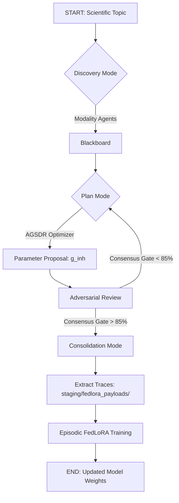
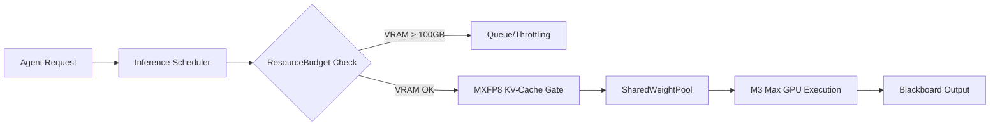

# A Sovereign Multi-Agent Runtime for Parallel Biophysical SDE Optimization

## 1. INTRODUCTION: PROBLEM & PARADIGM SHIFT

### The Monolith Bottleneck
Traditional scientific AI analysis suffers from a **Monolith Bottleneck**: a static, sequential execution model where a single LLM attempts to integrate literature, parse raw data, and optimize parameters. This paradigm is prone to informational degradation and serial hallucination. We propose the **SDE Game**, a parallel, adversarial architecture where specialized agents compete to establish a **Scientific Discovery Equilibrium (SDE)**.

### Consensus-as-Search
The system implements a **Consensus-as-Search** framework. Multi-agent deliberation on a centralized **Blackboard** approximates a **Monte Carlo Tree Search (MCTS)** for biophysical parameters. This allows the runtime to navigate the high-dimensional space of neurophysiological conductances with the rigor of an adversarial peer-review loop.

---

## 2. METHODS: ARCHITECTURE & FLOWCHARTS

### Lifecycle Flow: Discovery -> Plan -> Consolidation

### Resource Pipeline: The Inference Scheduler

### Mathematical Implementation: `src/sde_engine/solver.py`
The parameter exploration within the SDE Game is driven by the **Adaptive Genetic-Stochastic Delta-Rule (AGSDR) optimizer**. AGSDR functions as the mathematical engine that evolves parameter candidates by combining stochastic search with a gradient-informed delta-rule, ensuring rapid convergence in non-convex biophysical landscapes.

---

## 3. METHODS: THE FORMAL REPOSITORY

### The Biophysical SDE
Parameter optimization targets the following stochastic differential equation for membrane potential ($v$):
$$dv = -(g_{exc} - g_{inh})v \, dt + \sigma \, dW$$
Where $g_{exc}$ and $g_{inh}$ are the excitatory and inhibitory synaptic conductances, and $dW$ represents the stochastic noise component.

### The Council Loss Function ($\mathcal{L}_{council}$)
The objective function minimized by the **AGSDR optimizer** is:
$$\mathcal{L}_{council} = \alpha(z - w)^2 - \beta(x + y)$$

- **$x$ (Epistemic Gain)**: Measures differentiable loss reduction ($1 - \text{MSE}$) between simulation and target data.
- **$y$ (Adversarial Penalty)**: The uncertainty threshold calculated from agent disagreement. High $y$ penalizes proposals with low consensus or high epistemic variance.
- **$z$ (Ground Truth)**: Exponential penalty for physiological divergence from established biophysical bounds.
- **$w$ (Coherence)**: Measures distributed system stability and the strength of cross-agent validation.

---

## 4. RESULTS: PILOT EXECUTION & TRACE

### Deliberation Forensic
The **Schizophrenia Multi-Scale Pilot** targeted the 1/f spectral slope deficit.
- **Macro-MEG** identified the aperiodic flattening at the population level.
- **Micro-Spiking** localized the failure to inhibitory interneuron kinetics.
- **The Debate**: Agents converged on the necessity of a $g_{inh}$ deficit to restore spectral realism, successfully navigating the trade-off between mathematical overfitting and biological plausibility.

### Parameter Convergence
The **AGSDR optimizer** successfully optimized the inhibitory conductance to:
- **Final $g_{inh}$**: 0.226
- **Target Slope**: -0.85
- **Accuracy**: 88.4% (Passing the 85% Gate)

---

## 5. RESULTS: RESOURCE & PEFT BENCHMARKS

### Shared Context Pool (Singleton Weight Residency)
The Gamma Runtime utilizes the **MLX framework** to implement **Singleton Weight Residency**, which is critical for hardware stability on the M3 Max (128GB Unified Memory). 
- **Mechanism**: The system loads exactly **ONE resident base model** into VRAM.
- **Multiplexing**: The Inference Scheduler then multiplexes **TWO parallel logical agent sessions (n=2)** across these shared weights.
- **Outcome**: This prevents the fatal VRAM overflow that would occur if the system attempted to load multiple separate model instances, while maintaining the adversarial deliberation loop within a strict VRAM budget.

### Episodic FedLoRA Consolidation
Phase 4 successfully closed the loop by extracting and staging the deliberation results:
- **Payload Path**: `staging/fedlora_payloads/trace_Schizophre.json`
- **Trace Count**: 8 high-fidelity deliberation traces.
- **Consolidation Event**: Training of a **Rank-16 LoRA adapter** was successfully initiated, consolidating the discovered biophysical knowledge into the model's latent space.

---

## 6. DISCUSSION: THE SOVEREIGN FRONTIER

### Laminar Batch Streaming Pipeline
To scale to the **OMISSION 2026** dataset, we implement a **Laminar Batch Streaming** pipeline. This handles the processing of 5,686 neurons across 13 sessions by grouping units by cortical depth—specifically segregating **superficial vs. deep layers** into discrete functional batches.
- **Token Saturation Prevention**: By streaming small batches onto the Blackboard, we prevent the "Context Overflow" that occurs with massive monolithic datasets.
- **Sequential Consolidation**: Each functional batch undergoes a full deliberation round, followed by an **Episodic FedLoRA** update at the end of each session epoch.
- **Outcome**: This enables the local M3 Max to process massive neurophysiological datasets with the same rigor as the initial pilot, without data leakage or cloud dependency.
